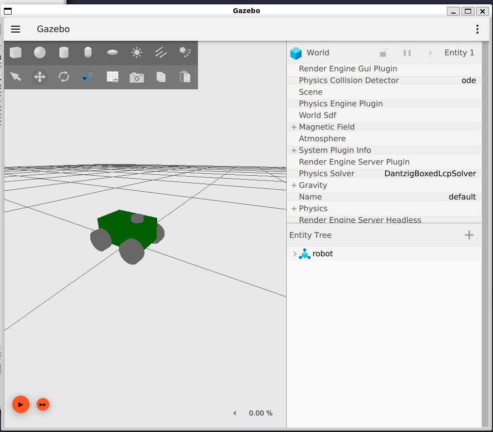

# Projeto ROS 2

Este repositório contém o código e documentação para o projeto do robô de 4 rodas, desenvolvido utilizando o framework ROS 2. O objetivo deste projeto é criar, simular e controlar o robô no ambiente Gazebo e implementar o `ros2_control` para gerenciar as funções do robô.

---

## Estrutura do Projeto

- **Gazebo Simulation:** Simulação do robô utilizando o Gazebo.
- **ROS2_control:** Planejado para configurar os controladores e interfaces necessárias.
- **Código:** Scripts e nós ROS 2 para operar o robô.

---

## Estado Atual do Projeto

- ✅ Robô configurado e inserido no ambiente Gazebo.
- ❌ Integração com o `ros2_control` ainda pendente.



---

## Dependências

- ROS 2 Humble
- Gazebo
- Pacotes adicionais ROS 2:
  - `ros2_control`
  - `robot_state_publisher`
  - `joint_state_controller`

---

## Instalação

1. Clone este repositório:

   ```bash
   git clone https://github.com/Malicancas/my_bot.git
