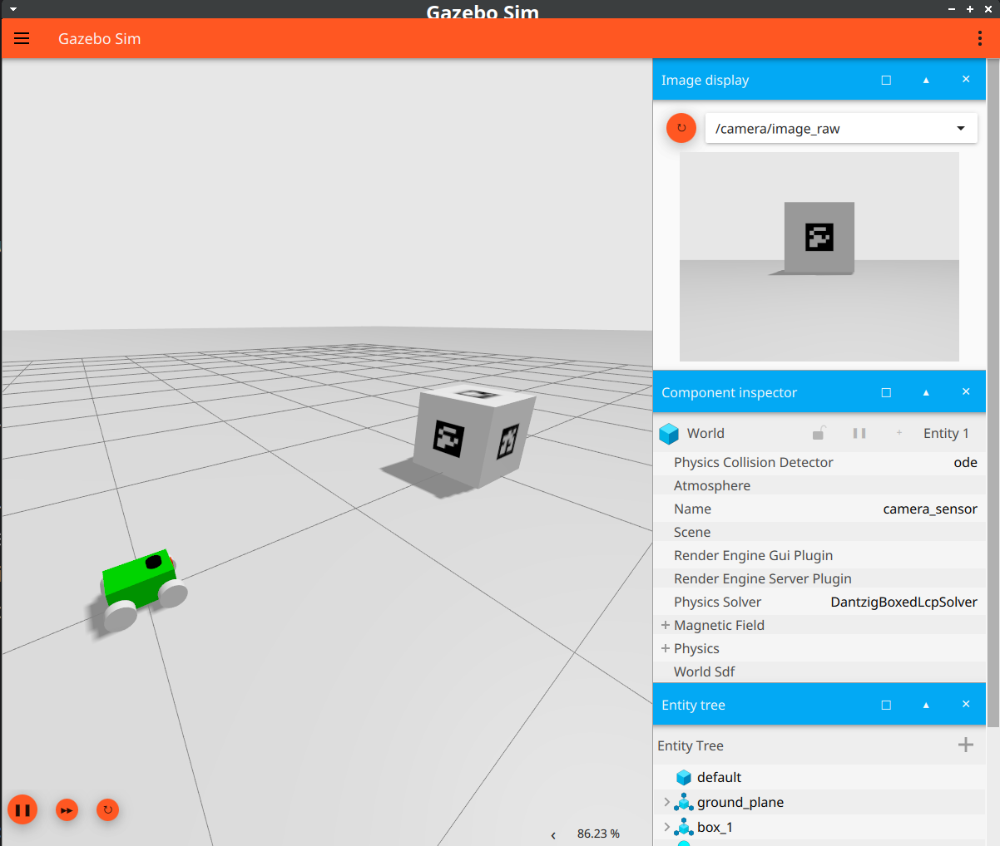
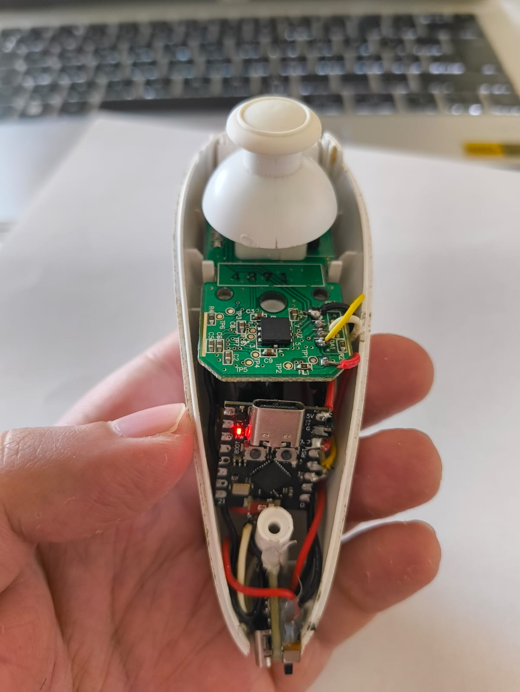

# Sucata - ROS 2 Jazzy

Projeto open source de robótica móvel com ROS 2 para simulação, controle e integração de sensores num robô de 4 rodas.

## Descrição

O **Sucata** é um robô de 4 rodas desenvolvido com o framework **ROS 2 (Jazzy)**, pensado para simulação no **Gazebo Harmonic** e controle via `ros2_control`. O projeto visa facilitar testes, integração de sensores (como LIDAR e camera para leitura de ArUco markers) e diferentes métodos de operação.

## Demonstração

<p float="left">
  
  
  
</p>

## Estado do Projeto

- Robô configurado e simulado no Gazebo ✅
- Controle funcional via `teleop_keyboard` ✅
- Controle funcional via `teleop_joy` ✅

## Tecnologias Utilizadas

- **ROS 2 Jazzy** (Ubuntu 24.04)
- **Gazebo Harmonic**
- `ros2_control`
- `robot_state_publisher`
- `joint_state_controller`
- **LIDAR** (`urg_node2`)
- **ArUco Markers** (`ros2_aruco`)

## Instalação

### Clone o repositório e dependências:

```bash
mkdir -p ros2ws/src
cd ros2ws/src
git clone https://github.com/Malicancas/sucata.git
git clone https://github.com/JMU-ROBOTICS-VIVA/ros2_aruco.git
git clone https://github.com/Hokuyo-aut/urg_node2.git
```

### Build e execução:

```bash
cd ..
colcon build
source install/setup.bash
ros2 launch sucata launch_sim.launch.py
```

### Para uso do controle BLE (Nunchuck):

```bash
git clone https://github.com/Malicancas/nunchuck-BLE
# Siga as instruções no repositório para configuração
```
