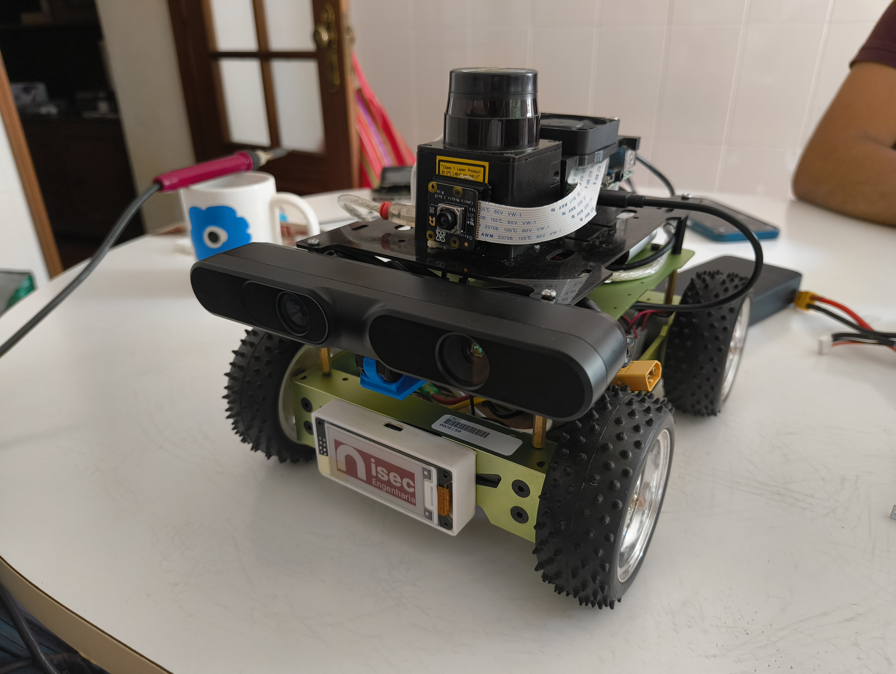
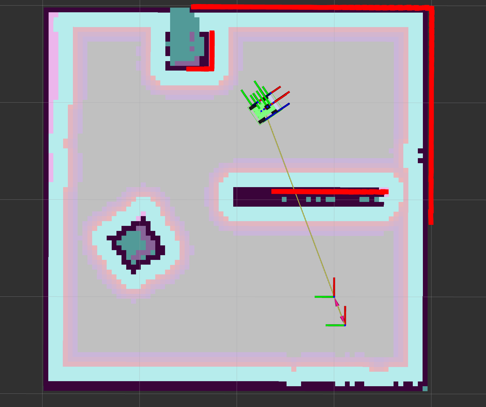

## Autores

- [@José Craveiro](https://github.com/Malicancas)

- [@Guilherme Filipe](https://github.com/guilassas)


# S.U.C.A.T.A - Sistema Unificado de Cartografia Autónoma e Tracking de ArUcos

O **SUCATA** é um robô de 4 rodas desenvolvido com o framework **ROS 2 Jazzy**, pensado para simulação no **Gazebo Harmonic** e controle via `ros2_control`. O projeto visa facilitar testes, integração de sensores (como LIDAR e camera para leitura de ArUco markers) e diferentes métodos de operação.

## Demonstração

<p float="left">
  
  
</p>

## Estado do Projeto

- Robô configurado e simulado no Gazebo ✅
    - Controle funcional via `teleop_keyboard` ✅
    - Controle funcional via `Nunchuck` ✅
    - Navegação ✅
    - Slam ✅
    - Camara de perfundidade - Sem integração na Navegação para já
    - Deteção de ArUco - Algoritmo de docking tem de ser trabalhado


## 📦 Pacotes externos utilizados

- [**LIDAR**](https://github.com/Hokuyo-aut/urg_node2) (`urg_node2`)
- [**ArUco Markers**](https://github.com/JMU-ROBOTICS-VIVA/ros2_aruco) (`ros2_aruco`)
- [**Asus Xtion Pro**](https://github.com/ros-drivers/openni2_camera) (`openni2_camera`)

## 💥 Lista de componentes
Componentes usados neste projeto:

| | Compontente |
| --| --|
|1| Raspberry Pi 4B (4 GB)|
|2| SanDisk 32 GB SD Card (minimo)|
|3| [Skeleton Bot 4WD hercules mobile robotic platform](https://wiki.seeedstudio.com/Skeleton_Bot-4WD_hercules_mobile_robotic_platform/)|
|4| [IMU MPU6050](https://pt.aliexpress.com/item/1005008404467219.html?src=google&pdp_npi=4@dis!EUR!1.92!1.38!!!!!@!12000044896717467!ppc!!!&gQT=2)|
|5| LiDAR URG-04LX|
|6| Raspberry Pi camera module 3|
|7| Asus Xtion Pro|
|8| Ventoinha 50mm 12V|
|9| [Stand Ventoinha 50mm](https://www.printables.com/model/443438-raspberry-pi-4-bracket-for-50mm-fan)|
|10| Bateria LiPo 4S 2400mAh 14.8V|
|11| Nunchuck modificado (ver repositório Nunchuck)|
|12| Dock USB com alimentação externa|
|13| Router TPLink MR3020 (optional)|


## Instalação
Os comandos seguintes estão a partir do principio que o utilizador já tem o ambiente ROS2 funcional e o Gazebo Harmonic, consultar a [documentação](https://docs.ros.org/en/jazzy/index.html) para mais informação.

**Setup simulação:**
```bash
#Criar workspace
mkdir -p ros2ws/src
cd ros2ws/src

#Clone do repositório principal
git clone https://github.com/Malicancas/sucata
```
**Build e simulação:**
```bash
#Dentro da pasta /ros2ws
colcon build --symlink-install
source install/setup.bash
ros2 launch sucata launch_sim.launch.py
```

**Setup Raspberry Pi:**

Para as seguintes configurações é aconselhada a ligação ao Raspberry Pi atráves de uma ligação SSH.

```bash
mkdir -p ros2ws/src
cd ros2ws/src

#Clone do branch RPI
git clone --single-branch --branch RPI https://github.com/Malicancas/sucata.git

#Package para a deteção de ArUcos
git clone https://github.com/JMU-ROBOTICS-VIVA/ros2_aruco.git

#Package para LiDAR
git clone https://github.com/Hokuyo-aut/urg_node2.git

#Package para a camâra de perfundidade
git clone https://github.com/ros-drivers/openni2_camera

```


**Para uso do controle BLE (Nunchuck):**

Fazer clone do repositório referido a baixo e seguir as instruções.
```bash
git clone https://github.com/Malicancas/nunchuck-BLE
```
